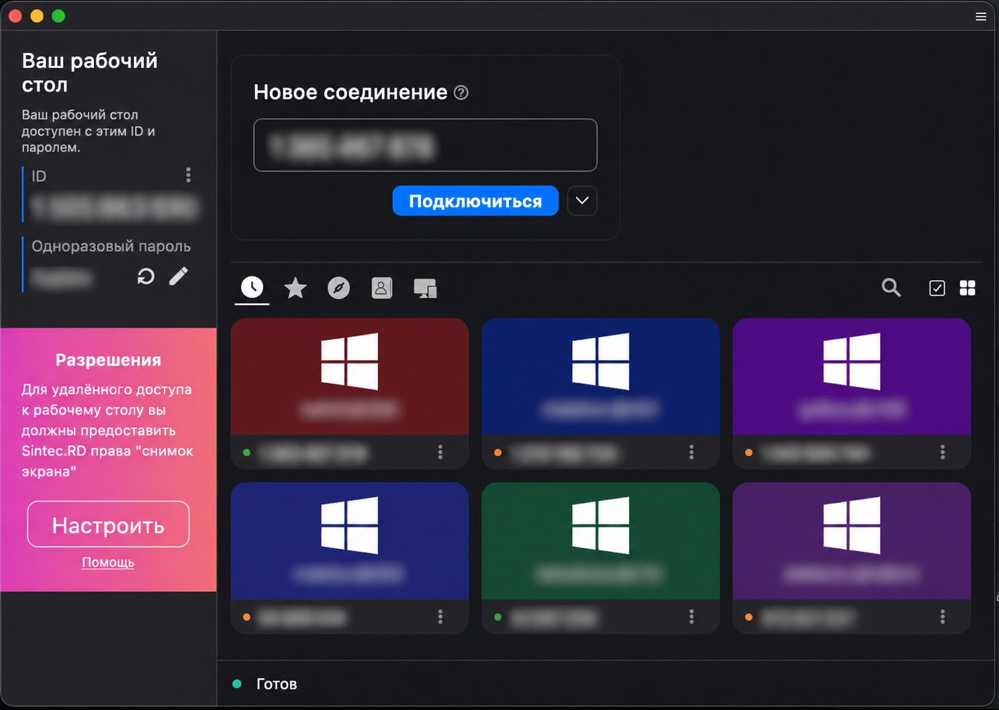
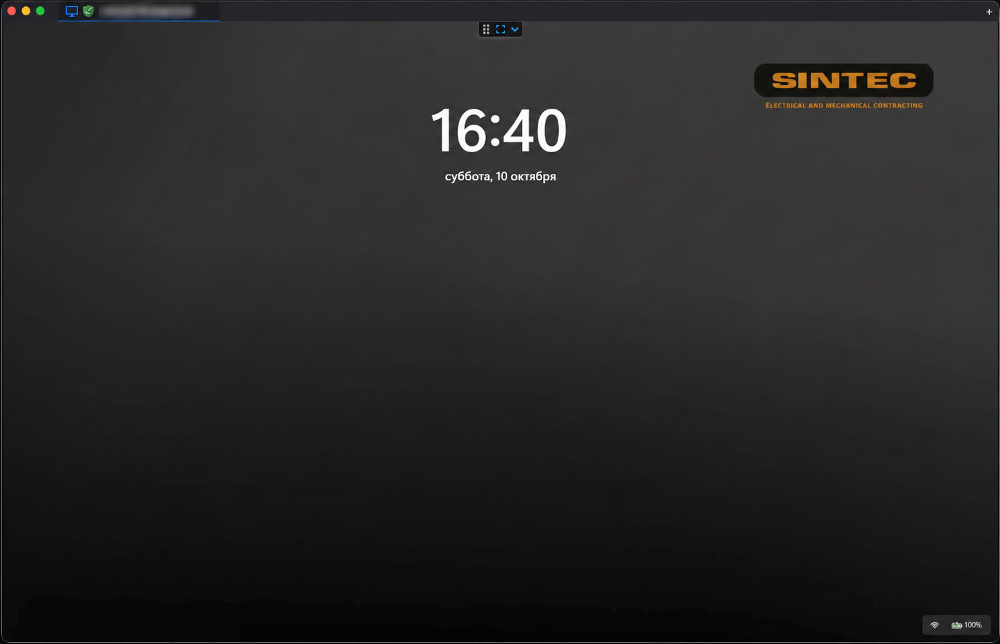

   
  <a href="../README.md">Русский</a> | <b>English</b> 
  <a href="https://github.com/ShcherbakovMikhail/Sintec.RD/releases">Download</a> •
  <a href="#screenshots">Screenshots</a>

# Sintec.RD

> [!Caution]
> **Misuse Disclaimer:**  
> The developers of RustDesk do not condone or support any unethical or illegal use of this software. Misuse, such as unauthorized access, control or invasion of privacy, is strictly against our guidelines. The authors are not responsible for any misuse of the application.

Sintec.RD is a corporate remote-access build based on [RustDesk](https://github.com/rustdesk/rustdesk). It includes a preconfigured organization server and public key, custom branding, and installers. The Windows distribution includes an EXE/MSI client and an Enterprise Agent.

## Screenshots

### Sintec.RD main window

### Remote desktop connection

Workstation IDs, the one-time password, and computer names are obscured in these screenshots.

## License

Sintec.RD is based on RustDesk. Source-code license terms are provided in [LICENSE](../LICENSE). Original-project copyright notices are retained.
